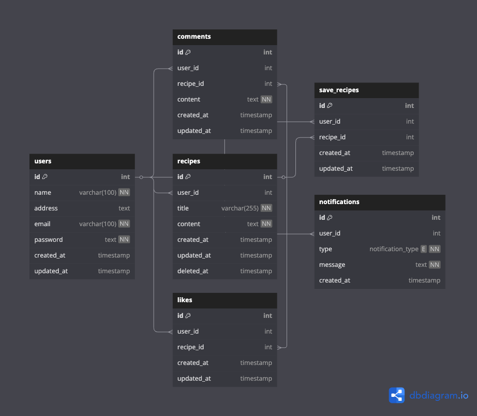

<h1 align="center">⚙️ Service Pace API</h1>
<p align="center">A RESTful API built with <b>Go (Golang)</b> and <b>Gin Framework</b> </p>
<p align="center">


</p>

---

# 📖 Docs
- [x] Swagger Docs <a href="https://service.pace11.my.id/swagger/index.html" target="_blank">(here)</a>
- [x] Postman Collection <a href="https://github.com/pace11/service-pace/tree/master/postman" target="_blank">(here)</a>

---

## 🥘 Share Recipe Foods
Platform sharing recipe
<div align="center"></div>

---

## 🚀 Features

<!-- - 📦 Modular Clean Architecture -->
- ✅ User Registration & Login (JWT Auth)
- 📋 Recipe CRUD (Create, Read, Update, Delete)
- ❤️ Like Recipes
- 💬 Comment on Recipes
- 🔔 Notification System
- 👤 User Profile Management
- 🔐 JWT Middleware Protected Routes

---

## 🏃 How to run

- Clone this repository
- Makesure you have a mysql database running locally
- Copy `.env.example` to `.env`
```bash
DB_USER="your database user" #root
DB_PASS="your database password" #root
DB_HOST="your database host" #localhost
DB_PORT="your database port" #3306
DB_NAME="your database name" #recipe
APP_PORT="app running port" #:4000
SECRET_KEY="" #for jwt secret
```
- Run with command `go run .`

---

## 🏗️ Pattern Using

- This project using **Modular Clean Architecture** with **Repository**, **Controller** and **Wiring** 🌟
- `Repository` code
```go
// example_repository.go

package repository

import (
	"github.com/gin-gonic/gin"
)

type ExampleRepository interface {
	Index(c *gin.Context) any
	Show(c *gin.Context, id string) any
	Create(c *gin.Context) any
	Update(c *gin.Context, id string) any
	Delete(c *gin.Context, id string) any
}

type exampleRepo struct {}

func NewExampleRepository() ExampleRepository {
    ...
	return &exampleRepo{}
}

func (r *exampleRepo) Index(c *gin.Context) any {
    ...
    return
}

func (r *exampleRepo) Show(c *gin.Context, id string) any {
    ...
    return
}

func (r *exampleRepo) Create(c *gin.Context) any {
    ...
    return
}

func (r *exampleRepo) Update(c *gin.Context, id string) any {
    ...
    return
}

func (r *exampleRepo) Delete(c *gin.Context, id string) any {
    ...
    return
}
```
- `Controller` code
```go
// example_controller.go

package controllers

import (
	"your-project/repository"
	"github.com/gin-gonic/gin"
)

type ExampleController struct {
	Repo repository.ExampleRepository
}

func NewExampleController(repo repository.ExampleRepository) *ExampleController {
	return &ExampleController{Repo: repo}
}

func (ctrl *ExampleController) GetExamples(c *gin.Context) {
    ctrl.Repo.Index(c)
}

func (ctrl *ExampleController) GetExampleByID(c *gin.Context) {
    idExample := c.Param("id")
    ctrl.Repo.Show(c, idExample)
}

func (ctrl *ExampleController) CreateExample(c *gin.Context) {
    ctrl.Repo.Create(c)
}

func (ctrl *ExampleController) UpdateExampleByID(c *gin.Context) {
    idExample := c.Param("id")
    ctrl.Repo.Update(c, idExample)
}

func (ctrl *ExampleController) DeleteExampleByID(c *gin.Context) {
    idExample := c.Param("id")
    ctrl.Repo.Delete(c, idExample)
}
```
- `Wiring` code
```go
// wire/app.go

package wire

import (
	"your-project/controllers"
	"your-project/repository"
)

type App struct {
	ExampleController *controllers.ExampleController
}

func InitApp() *App {
	// repository
	exampleRepo := repository.NewExampleRepository()

	// controller
	exampleCtrl := controllers.NewExampleController(exampleRepo)

	return &App{
		ExampleController: noteCtrl,
	}
}

```