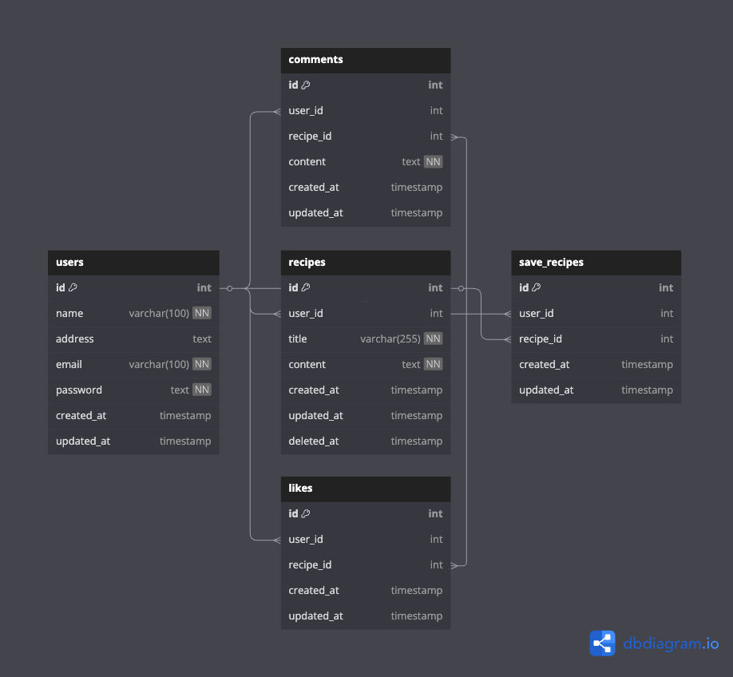

# SERVICE ⚙️
<b>Service</b> for development and testing stage

# DOCS 📖
- [x] Swagger Docs <a href="https://service.pace11.my.id/swagger/index.html" target="_blank">(here)</a>
- [x] Postman Collection 🔜

## 1️⃣ Recipes App 🍲
Platform sharing recipe

<h3>Stack App</h3>
<ul>
<li>GO ✅</li>
<li>MySQL ✅</li>
<li>Gorm ✅</li>
<li>JWT ✅</li>
<li>Docker ✅</li>
<li>Docker Compose ✅</li>
<li>Github Action Autodeployment ✅</li>
</ul>